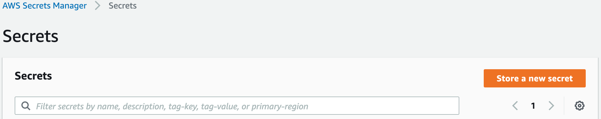

===============
Getting Started
===============

So you want to give Keydra a go? Here's how you deploy it to an AWS account with a starter secret under management.

You will need
=============

* An AWS account. Don't have one, free tier is fine! Go get a free one at https://aws.amazon.com/free !

* An Atlassian Bitucket account, to host your Keydra configuration. We only support Bitbucket right now, but expect to add other code repository providers in the future. 
You can `create a free account here. <https://id.atlassian.com/signup?application=bitbucket>`_

==================
Initial Deployment
==================

Setup a configuration repository
================================

1.  Create a new private repository in Bitbucket. Let's call it `KeydraConfiguration`.

.. image:: _static/create_repo.png
    :width: 400px
    :alt: Create a Bitbucket repository

2.  Clone your new repo locally. Click the *Clone* button at the top right of your new repo's `Source` page, and paste into your terminal.
    
    Note: You may need to setup an SSH key for this, `see here for help if needed. <https://support.atlassian.com/bitbucket-cloud/docs/set-up-an-ssh-key/>`_

.. code-block:: bash

    git clone git@bitbucket.org:<your BB username>/keydraconfiguration.git
    cd keydraconfiguration

3.  Create a new directory called `config`, and initialise your environments and secrets files. 
    We'll start with one AWS environment (i.e. account) called `main`, and one sample secret called `sample`.

.. code-block:: bash

    mkdir config && cd config
    touch environments.yaml secrets.yaml

4.  Edit `environments.yaml`. This file tells Keydra about the AWS account it will deploy to, and which secrets to manage there.

.. code-block:: yaml

    dev:
      description: Our Development AWS account
      type: aws
      access: dev
      id: <your AWS account ID>
      secrets:
        - sample

5.  For this example, we've told Keydra that this account is a `dev` one, but could also be `production` or `uat`.
    The `sample` line tells Keydra to manage that secret in this environment, which we'll now define!
    You can add lots of environments (i.e. AWS accounts) to this file, just follow the same format and append.

6.  Edit `secrets.yaml`. This file tells Keydra about our secrets, just one for the time being - update with your Bitbucket username!
    Note that the repository name here needs to be all lower case.

.. code-block:: yaml

    sample:
          key: keydra_managed_sample
          description: A example secret which exists in IAM
          custodians: my_team
          provider: IAM
          rotate: nightly
          config:
            groups:
              - MyDeploymentGroup
          distribute:
          - config:
              repository: keydraconfiguration
              account_username: <your bb username>
            envs:
            - dev
            key: AWS_ACCESS_KEY_ID
            provider: bitbucket
            scope: repository
            source: key
          - config:
              repository: keydraconfiguration
              account_username: <your bb username>
            envs:
            - dev
            key: AWS_SECRET_ACCESS_KEY
            provider: bitbucket
            scope: repository
            source: secret

7.  Now push your config up to Bitbucket.

.. code-block:: bash

    git add .
    git commit -m "Initial commit"
    git push origin main

What have we setup? This secret will create/manage an IAM user, which we'll rotate the password every night, and distribute the key and secret as two environment variables in our new Bitbucket repository.
Why would you do this? You could use these credentials in Bitbucket pipelines to deploy code to AWS. Rather than hardcoding these values in your repo, this way Keydra will ensure that they are:

* using your least privilege deploy IAM group (`MyDeploymentGroup`, which we'll create soon)

* are changed (very!) frequently to limit impact if compromised/exposed

* are not seen by sneaky humans that can put them onto sticky notes or sell on the dark web!

Deploy Keydra to AWS
====================

1.  On your local machine, clone the Keydra role and install dependencies. Always best to create/activate a Python `virtualenv` first, but will leave that up to you.

.. code-block:: bash

    git clone https://github.com/Athena-Home-Loans/keydra.git
    cd keydra
    pip install -r requirements-dev.txt
    pip install -r src/requirements.txt

2.  Friends don't let friends use admin for everything!! Login to your AWS account console, and create a new IAM user called `keydra_deploy`, with programmatic access only and
    a policy like that in `docs/en/KeydraDeploy.json`.

3.  Create an access key for the `keydra_deploy` user and stash the AWS_ACCESS_KEY_ID and AWS_SECRET_ACCESS_KEY as `enviroment variables in your terminal. <https://docs.aws.amazon.com/sdk-for-php/v3/developer-guide/guide_credentials_environment.html>`_

4.  Now, we're going to use `AWS SAM<https://aws.amazon.com/serverless/sam/>`_ to deploy two CloudFormation stacks. The first one (`keydraExecRole`)sets up a least privilege role to run Keydra with. 
    Execute the following on your local machine, changing the region to match your needs.

.. code-block:: bash

    sam build -t docs/en/KeydraExecRole.yaml
    sam deploy -t docs/en/KeydraExecRole.yaml --stack-name keydraExecRole --capabilities CAPABILITY_IAM CAPABILITY_AUTO_EXPAND CAPABILITY_NAMED_IAM --region ap-southeast-2 

5.  Assuming the SAM run was successful, you should see an outputs block with an Arn for the new role. Note this down, we'll need this for step 7.

6.  Now we'll create the second stack, this one for `keydra` itself. Copy `docs/en/sample_template.yaml` to your main keydra directory as `template.yaml`.
    This is a nice SAM template that will make this easy!

.. code-block:: bash

    cp docs/en/sample_template.yaml template.yaml

7.  Edit `template.yaml`. This looks daunting, but you only need to change the 6 values in angle brackets.

    * `IAM Role Arn` - This is the ARN to an AWS IAM role that you'll use to run Keydra, from step 5.
    * `bb account name` - The Bitbucket account name from the first section.
    * `secrets repo name` - The Bitbucket repository name. In this example, this is `KeydraConfiguration`.
    * `path to secrets.yaml` - The path to our secrets. For our example, this is  `src/main/config/secrets.yaml`
    * `environments repo name` - We'll use the same repo, use `KeydraConfiguration`.
    * `path to environments.yaml` - The path to our environments definition. For our example, this is  `src/main/config/environments.yaml`

8. Build and deploy with SAM. Make sure Docker is installed/running first!

.. code-block:: bash

    sam build --use-container
    sam deploy --stack-name keydra --capabilities CAPABILITY_IAM CAPABILITY_AUTO_EXPAND --region ap-southeast-2

Bootstrap and Test Run
======================

We're just about there! We just need to bootstrap BitBucket connections, and we can do an adhoc trial run of the lamnda!

1.  Create App password for your Bitbucket user. Click your user avatar in the bottom left corner, then `Personal settings` > `App passwords`.
    Click the blue `Create app password` button.

2.  Call the App password `keydra`, and minimum permissions. Click `Create`.

.. image:: _static/perms_app_password.png
    :width: 400px
    :alt: Configure App password permissions

3. You'll be shown a password, which you'll only see once! In another tab, login to the AWS Console and navigate to the `Secrets Manager` service.

4. Click the orange `Store a new secret` button.

5. Choose a secret type of `Other type of secrets`, and add a plaintext secret as follows (substituting your details).

.. code-block:: json

    {
    "password": "<the password from step 3>",
    "username": "<your bb username>"
    }

6.  You can leave encyption settings as default, or update to your needs. Click `Next`.

7.  Call your secret `keydra/bitbucket`, and add a tag of 'managedby'='keydra'. Click `Next`.

8.  Auto rotation is not required (Keydra will do this), so just click `Next` on the next screen, then `Store` on the one after.

9.  Time to give it a go! In the AWS Console, navigate to the `Lambda` service.

10. You should see a `keydra` function, open it up.

11. Scroll down a little, and select the `Test` tab. Test with the following event, which tells Keydra to run a `Nightly` run
    with debug enabled. Click the `Test` button to run Keydra.

.. code-block:: json

    {
    "trigger": "nightly",
    "debug": true
    }

.. image:: _static/test_function.png
    :width: 400px
    :alt: Test Keydra!

12. With a little luck, you should see something like this!

.. image:: _static/success.png
    :width: 400px
    :alt: Success!

13. What just happened? Keydra created an IAM user in AWS, and then stored the IAM username and password in two separate
    repository variables in Bitbucket. You can see the results in Bitbucket under your repo; browse to `Repository settings` > 
    `Repository variables`

.. image:: _static/repo_vars.png
    :width: 400px
    :alt: Our new vars

You can now use these values to deploy your code to AWS, and Keydra will kindly rotate them automagically every night, without
you needing to do a thing!
