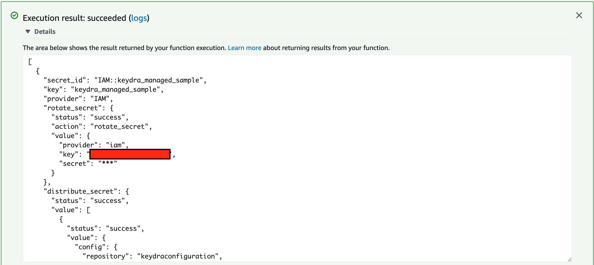

===============
Getting Started
===============

So you want to give Keydra a go? Here's how you deploy it to an AWS account with a starter secret under management.

You will need
=============

* An AWS account. Don't have one, free tier is fine! Go get a free one at https://aws.amazon.com/free !

* An Atlassian Bitbucket or a Github account, to host your Keydra configuration. We only support Bitbucket and Github right now, but expect to add other code repository providers in the future. 

==================
Initial Deployment
==================

Setup a configuration repository
================================

1.  Create a new private repository, clone it locally, and change to the new directory. See the relevant guide for your
    preferred platform option:

    * :ref:`Github <setup_github>`
    * :ref:`Bitbucket <setup_bitbucket>`

2.  Create a new directory called `config`, and initialise your environments and secrets files. 
    We'll start with one AWS environment (i.e. account) called `main`, and one sample secret called `sample`.

.. code-block:: bash

    mkdir config && cd config
    touch environments.yaml secrets.yaml

3.  Edit `environments.yaml`. This file tells Keydra about the AWS account it will deploy to, and which secrets to manage there.

.. code-block:: yaml

    dev:
      description: Our Development AWS account
      type: aws
      access: dev
      id: <your AWS account ID>
      secrets:
        - sample

4.  For this example, we've told Keydra that this account is a `dev` one, but could also be `production` or `uat`.
    The `sample` line tells Keydra to manage that secret in this environment, which we'll now define!
    You can add lots of environments (i.e. AWS accounts) to this file, just follow the same format and append.

5.  Edit `secrets.yaml`. This file tells Keydra about our secrets, just one for the time being - update with your 
    repo organisation or user name, and update the `provider` key to match your code repo type. Note that the repository name here needs to be all lower case.

.. code-block:: yaml

    sample:
          key: keydra_managed_sample
          description: A example secret which exists in IAM
          custodians: my_team
          provider: IAM
          rotate: nightly
          config:
            groups:
              - MyDeploymentGroup
          distribute:
          -
            config:
              repository: keydraconfiguration
              account_username: <your repo org or user name>
              scope: repository
            envs:
                - dev
            key: AWS_ACCESS_KEY_ID
            provider: <bitbucket OR github>
            source: key
          -
            config:
              repository: keydraconfiguration
              account_username: <your repo org or user name>
              scope: repository
            envs:
                - dev
            key: AWS_SECRET_ACCESS_KEY
            provider: <bitbucket OR github>
            source: secret

6.  Now push your config up to the repo.

.. code-block:: bash

    git add .
    git commit -m "Initial commit"
    git push origin main

What have we setup? This secret will create/manage an IAM user, which we'll rotate the password every night, and distribute
the key and secret as two environment variables in our new code repository. Why would you do this? You could use these
credentials in pipelines to deploy code to AWS. Rather than hardcoding these values in your repo, this way Keydra will ensure
that they are:

* using your least privilege deploy IAM group (`MyDeploymentGroup`, which we'll create soon)

* are changed (very!) frequently to limit impact if compromised/exposed

* are not seen by sneaky humans that can put them onto sticky notes or sell on the dark web!

Deploy Keydra to AWS
====================

1.  On your local machine, clone the Keydra role and install dependencies. Always best to create/activate a Python `virtualenv` first, but will leave that up to you.

.. code-block:: bash

    git clone https://github.com/Athena-Home-Loans/keydra.git
    cd keydra
    pip install -r requirements-dev.txt
    pip install -r src/requirements.txt

2.  Friends don't let friends use admin for everything!! Login to your AWS account console, and create a new IAM user called `keydra_deploy`, with programmatic access only and
    a policy like that in `docsrc/KeydraDeploy.json`.

3.  Create an access key for the `keydra_deploy` user and stash the AWS_ACCESS_KEY_ID and AWS_SECRET_ACCESS_KEY as `enviroment variables in your terminal. <https://docs.aws.amazon.com/sdk-for-php/v3/developer-guide/guide_credentials_environment.html>`_

4.  Now, we're going to use `AWS SAM <https://aws.amazon.com/serverless/sam/>`_ to deploy two CloudFormation stacks. The first one (`keydraExecRole`)sets up a least privilege role to run Keydra with. 
    Execute the following on your local machine, changing the region to match your needs.

.. code-block:: bash

    sam build -t docsrc/KeydraExecRole.yaml
    sam deploy -t docsrc/KeydraExecRole.yaml --stack-name keydraExecRole --capabilities CAPABILITY_IAM CAPABILITY_AUTO_EXPAND CAPABILITY_NAMED_IAM --region ap-southeast-2 

5.  Assuming the SAM run was successful, you should see an outputs block with an Arn for the new role. Note this down, we'll need this for step 7.

6.  Now we'll create the second stack, this one for `keydra` itself. Copy `docsrc/sample_template.yaml` to your main Keydra directory as `template.yaml`.
    This is a nice SAM template that will make this easy!

.. code-block:: bash

    cp docsrc/sample_template.yaml template.yaml

7.  Edit `template.yaml`. This looks daunting, but you only need to change the 6 values in angle brackets.

    * `IAM Role Arn` - This is the ARN to an AWS IAM role that you'll use to run Keydra, from step 5.
    * `repo account name` - The code repo account or organisation name from the first section.
    * `secrets repo name` - The repository name. In this example, this is `KeydraConfiguration`.
    * `path to secrets.yaml` - The path to our secrets. For our example, this is `src/main/config/secrets.yaml` for Bitbucket, or `main/config/secrets.yaml` for Github.
    * `environments repo name` - We'll use the same repo, use `KeydraConfiguration`.
    * `path to environments.yaml` - The path to our environments definition. For our example, this is `src/main/config/environments.yaml` for Bitbucket, or `main/config/environments.yaml` for Github.

8. Build and deploy with SAM. Make sure Docker is installed/running first!

.. code-block:: bash

    sam build --use-container
    sam deploy --stack-name keydra --capabilities CAPABILITY_IAM CAPABILITY_AUTO_EXPAND --region ap-southeast-2

Test Run
========

Let's do an adhoc trial run of the lambda!

1.  In the AWS Console, navigate to the `Lambda` service.

2. You should see a `keydra` function, open it up.

3. Scroll down a little, and select the `Test` tab. Test with the following event, which tells Keydra to run a `Nightly` run
    with debug enabled. Click the `Test` button to run Keydra.

.. code-block:: json

    {
    "trigger": "nightly",
    "debug": true
    }

.. image:: _static/test_function.png
    :width: 400px
    :alt: Test Keydra!

4. With a little luck, you should see something like this!

5. What just happened? Keydra created an IAM user in AWS, and then stored the IAM username and password in two separate
    repository variables in your code repository. You can see the results under your repo; browse to `Repository settings` > 
    `Repository variables` in Bitbucket, or `Settings` > `Secrets` in Github.

.. image:: _static/repo_vars.png
    :width: 400px
    :alt: Our new vars (BB)

.. image:: _static/repo_vars_gh.png
    :width: 400px
    :alt: Our new vars (GH)

You can now use these values to deploy your code to AWS, and Keydra will kindly rotate them automagically every night, without
you needing to do a thing!
